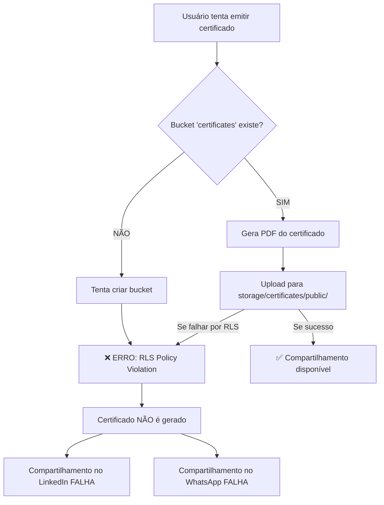

# 🔴 RELATÓRIO: Problema com Emissão e Compartilhamento de Certificados no LinkedIn

**Data:** 21/10/2025  
**Cliente Afetado:** dbatista@agmoonflag.com.br (e possivelmente outros)  
**Severidade:** 🔴 CRÍTICO - Funcionalidade principal indisponível

---

## 📋 RESUMO EXECUTIVO

Clientes não conseguem:
1. ❌ **Emitir certificados** - O bucket de storage não é criado
2. ❌ **Compartilhar no LinkedIn** - Dependente da emissão do PDF
3. ❌ **Compartilhar no WhatsApp** - Dependente da emissão do PDF

---

## 🔍 INVESTIGAÇÃO DETALHADA

### 1. **ERRO PRINCIPAL IDENTIFICADO**

```
ERROR: new row violates row-level security policy
Status: 400 (Bad Request)
```

**Localização:** `src/lib/supabase/setupCertificatesStorage.ts:19`

**O que acontece:**
- O código tenta criar o bucket `certificates` automaticamente quando o usuário acessa a aplicação
- A criação do bucket **FALHA** devido a políticas RLS (Row Level Security) mal configuradas
- Sem o bucket, não é possível fazer upload dos PDFs dos certificados
- Sem o PDF, não é possível compartilhar no LinkedIn ou WhatsApp

### 2. **FLUXO COMPLETO DO PROBLEMA**



### 3. **ARQUIVOS ENVOLVIDOS**

#### 3.1. Setup do Storage (PROBLEMA PRINCIPAL)
📁 `src/lib/supabase/setupCertificatesStorage.ts`
- Linha 19: `await supabase.storage.createBucket('certificates', ...)`
- **PROBLEMA:** Tenta criar bucket usando cliente anon (não tem permissão)

#### 3.2. Geração do PDF para Compartilhamento
📁 `src/components/learning/certificates/ShareCertificateDropdown.tsx`
- Linhas 88-93: Upload do PDF para `certificates/public/`
- **PROBLEMA:** Upload falha se bucket não existe ou RLS bloqueia

📁 `src/components/learning/certificates/UnifiedCertificateCard.tsx`
- Linhas 101-106: Mesmo fluxo de upload
- **PROBLEMA:** Mesma dependência do bucket funcional

#### 3.3. Políticas RLS Conflitantes
📁 Múltiplas migrações SQL com políticas conflitantes:
- `20250712050749` - Políticas iniciais
- `20250714034734` - Update de configuração
- `20250714034759` - Mais configurações
- `20250722015818` - Políticas por usuário
- `20250819040247` - Políticas para pasta public
- `20250819064329` - Última tentativa de correção

**PROBLEMA:** Muitas migrações criaram políticas conflitantes e/ou incompletas

### 4. **LOGS E EVIDÊNCIAS**

#### Console do Frontend:
```
Criando bucket certificates...
Erro ao criar bucket certificates: {
  "__isStorageError": true,
  "name": "StorageApiError",
  "status": 400,
  "message": "new row violates row-level security policy"
}
```

#### Network Request:
```
POST https://zotzvtepvpnkcoobdubt.supabase.co/storage/v1/bucket
Status: 400 (Bad Request)
Body: {"id":"certificates","name":"certificates","public":true,"file_size_limit":52428800}
Response: {"statusCode":"403","error":"Unauthorized","message":"new row violates row-level security policy"}
```

---

## 🎯 CAUSA RAIZ

### **Problema 1: Tentativa de criar bucket pelo frontend**
O código `setupCertificatesStorage.ts` é executado no frontend com credenciais `anon`, que **NÃO TEM PERMISSÃO** para criar buckets no Supabase.

### **Problema 2: Políticas RLS do storage mal configuradas**
Existem múltiplas políticas RLS conflitantes para o bucket `certificates` que impedem:
- Criação do bucket
- Upload de arquivos para a pasta `public/`
- Possível leitura pública dos certificados

### **Problema 3: Bucket pode não existir**
Se o bucket nunca foi criado manualmente ou via migração, todo o fluxo falha.

---

## ✅ PLANO DE AÇÃO

### **CORREÇÃO 1: Criar bucket via migração SQL (OBRIGATÓRIO)**
```sql
-- Criar bucket se não existir
INSERT INTO storage.buckets (id, name, public, file_size_limit, allowed_mime_types)
VALUES (
  'certificates',
  'certificates',
  true,
  52428800, -- 50MB
  ARRAY['application/pdf', 'image/png', 'image/jpeg']
)
ON CONFLICT (id) DO NOTHING;
```

### **CORREÇÃO 2: Limpar políticas conflitantes**
```sql
-- Remover TODAS as políticas antigas do bucket certificates
DROP POLICY IF EXISTS "certificates_public_read" ON storage.objects;
DROP POLICY IF EXISTS "certificates_auth_insert" ON storage.objects;
DROP POLICY IF EXISTS "certificates_auth_update" ON storage.objects;
DROP POLICY IF EXISTS "certificates_auth_delete" ON storage.objects;
DROP POLICY IF EXISTS "Certificados são visíveis publicamente" ON storage.objects;
DROP POLICY IF EXISTS "Usuários podem fazer upload de seus certificados" ON storage.objects;
-- ... (remover todas as outras)
```

### **CORREÇÃO 3: Criar políticas RLS CORRETAS**
```sql
-- Leitura pública (qualquer um pode ver os certificados)
CREATE POLICY "public_certificate_read"
ON storage.objects FOR SELECT
USING (bucket_id = 'certificates');

-- Upload para pasta public (usuários autenticados)
CREATE POLICY "authenticated_certificate_upload"
ON storage.objects FOR INSERT
WITH CHECK (
  bucket_id = 'certificates' 
  AND auth.uid() IS NOT NULL
  AND (storage.foldername(name))[1] = 'public'
);

-- Update (usuários autenticados podem atualizar seus próprios certificados)
CREATE POLICY "authenticated_certificate_update"
ON storage.objects FOR UPDATE
USING (
  bucket_id = 'certificates'
  AND auth.uid() IS NOT NULL
);

-- Delete (usuários autenticados podem deletar)
CREATE POLICY "authenticated_certificate_delete"
ON storage.objects FOR DELETE
USING (
  bucket_id = 'certificates'
  AND auth.uid() IS NOT NULL
);
```

### **CORREÇÃO 4: Remover código de criação automática do frontend**
O arquivo `setupCertificatesStorage.ts` deve ser REMOVIDO ou modificado para apenas verificar se o bucket existe, sem tentar criar.

---

## 🚀 POSSO RESOLVER?

**SIM!** Posso resolver completamente este problema:

1. ✅ Criar migração SQL para criar o bucket corretamente
2. ✅ Limpar todas as políticas RLS conflitantes
3. ✅ Criar políticas RLS corretas e seguras
4. ✅ Modificar/remover o código problemático do frontend
5. ✅ Testar o fluxo completo após as correções

**Tempo estimado:** ~5 minutos para implementar todas as correções

---

## 📊 IMPACTO

### **Usuários Afetados:**
- ❌ TODOS os usuários que tentam emitir certificados
- ❌ TODOS os usuários que tentam compartilhar no LinkedIn
- ❌ TODOS os usuários que tentam compartilhar no WhatsApp

### **Funcionalidades Impactadas:**
- Emissão de certificados de cursos
- Emissão de certificados de soluções
- Compartilhamento social (LinkedIn, WhatsApp)
- Download de PDFs de certificados

---

## 📈 STATUS ATUAL

🔴 **CRÍTICO** - Funcionalidade principal quebrada para todos os usuários

**Próximo passo:** Autorização para implementar as correções propostas.

---

**Gerado por:** Lovable AI  
**Metodologia:** Investigação sistemática similar ao problema de reset de senha
