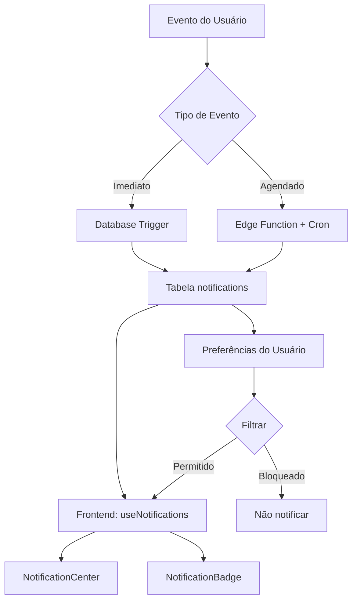

# 🔔 Sistema de Notificações - Overview Completo

## 📋 Índice

1. [Visão Geral](#visão-geral)
2. [Arquitetura](#arquitetura)
3. [Fases Implementadas](#fases-implementadas)
4. [Configuração](#configuração)
5. [Tipos de Notificação](#tipos-de-notificação)
6. [Edge Functions e Cron Jobs](#edge-functions-e-cron-jobs)
7. [Guia de Implementação Frontend](#guia-de-implementação-frontend)
8. [Monitoramento e Métricas](#monitoramento-e-métricas)
9. [Troubleshooting](#troubleshooting)

---

## 🎯 Visão Geral

Sistema completo de notificações em tempo real que cobre todas as áreas da plataforma:

- **Fase 1**: Sistema base (✅ Implementada)
- **Fase 2**: Eventos (✅ Implementada)
- **Fase 3**: Formações/Learning (✅ Implementada)
- **Fase 4**: Ferramentas/Soluções (✅ Implementada)
- **Fase 5**: Comunidade (✅ Implementada)

### Características Principais

✅ **Notificações em Tempo Real** via triggers do banco de dados  
✅ **Notificações Agendadas** via Edge Functions e Cron Jobs  
✅ **Recomendações Inteligentes** baseadas em comportamento  
✅ **Gamificação** com conquistas e badges  
✅ **Preferências Granulares** por tipo de notificação  
✅ **Metadata Rico** para contexto completo  
✅ **Performance Otimizada** com índices e queries eficientes  

---

## 🏗️ Arquitetura

### Componentes do Sistema



### Fluxo de Dados

1. **Evento ocorre** (ex: novo comentário, registro em evento)
2. **Trigger dispara** automaticamente no banco
3. **Validações** (evitar duplicatas, self-notifications)
4. **Criação da notificação** na tabela `notifications`
5. **Frontend recebe** via polling ou realtime subscription
6. **Renderização** no NotificationCenter

---

## 📦 Fases Implementadas

### Fase 1: Sistema Base ✅

**Tabela Principal**: `notifications`

**Campos**:
- `id`, `user_id`, `type`, `title`, `message`
- `metadata` (JSONB), `read_at`, `created_at`

**Features**:
- Preferências de notificação por tipo
- Limpeza automática (30 dias)
- Índices otimizados

**Documentação**: `docs/notifications-base-phase1.md`

---

### Fase 2: Eventos ✅

**Triggers Implementados**:
- `notify_event_registration()` - Inscrição confirmada
- `notify_event_cancellation()` - Inscrição cancelada
- `notify_event_completion()` - Evento concluído

**Edge Functions**:
- `process-event-reminders` - Lembretes automáticos (24h, 1h, 15min)
- `process-event-completion` - Marcar eventos como concluídos
- `event-register` - Registro em eventos

**RPC Functions**:
- `process_event_reminders()` - Processar lembretes

**Tipos de Notificação**:
```
event_registration_confirmed
event_registration_cancelled
event_completed
event_reminder_24h
event_reminder_1h
event_reminder_15min
```

**Cron Sugerido**: A cada 15 minutos
```toml
[functions.process-event-reminders]
schedule = "*/15 * * * *"
```

**Documentação**: `docs/notifications-events-phase2.md`

---

### Fase 3: Formações/Learning ✅

**Triggers Implementados**:
- `notify_new_course_published()` - Novo curso disponível
- `notify_new_lesson_available()` - Nova aula publicada
- `notify_module_unlocked()` - Módulo desbloqueado
- `notify_certificate_ready()` - Certificado disponível
- `notify_learning_comment_reply()` - Resposta a comentário
- `notify_course_content_updated()` - Conteúdo atualizado

**Edge Functions**:
- `process-course-reminders` - Lembretes de cursos inacabados
- `check-course-milestones` - Milestones (25%, 50%, 75%)
- `recommend-courses` - Recomendações personalizadas

**RPC Functions**:
- `process_course_reminders()` - Identificar cursos inacabados
- `check_course_milestones(user_id, course_id)` - Verificar milestones

**Tipos de Notificação**:
```
learning_new_course
learning_new_lesson
learning_module_unlocked
learning_certificate_ready
learning_comment_reply
learning_content_updated
learning_course_reminder
learning_milestone
learning_course_recommendation
```

**Cron Sugerido**: Diário às 10h
```toml
[functions.process-course-reminders]
schedule = "0 10 * * *"

[functions.recommend-courses]
schedule = "0 10 * * 1"  # Segunda-feira 10h
```

**Documentação**: `docs/notifications-learning-phase3.md`

---

### Fase 4: Ferramentas/Soluções ✅

**Triggers Implementados**:
- `notify_new_tool_published()` - Nova ferramenta publicada
- `notify_tool_updated()` - Ferramenta atualizada
- `notify_tool_new_comment()` - Novo comentário
- `notify_tool_comment_reply()` - Resposta a comentário
- `notify_tool_approved()` - Ferramenta aprovada
- `notify_tool_rejected()` - Ferramenta rejeitada

**Edge Functions**:
- `process-tool-recommendations` - Recomendações semanais

**RPC Functions**:
- `recommend_tools_for_user(user_id)` - Recomendar ferramentas
- `process_tool_recommendations()` - Processar recomendações

**Tipos de Notificação**:
```
tool_new_published
tool_updated
tool_new_comment
tool_comment_reply
tool_approved
tool_rejected
tool_recommendations
```

**Cron Sugerido**: Domingo às 10h
```toml
[functions.process-tool-recommendations]
schedule = "0 10 * * 0"
```

**Documentação**: `docs/notifications-tools-phase4.md`

---

### Fase 5: Comunidade ✅

**Triggers Implementados**:
- `notify_community_topic_reply()` - Resposta em tópico
- `notify_community_post_reply()` - Resposta a comentário
- `notify_user_mention()` - Menção (@username)
- `notify_post_liked()` - Milestones de likes (1, 5, 10, 25, 50, 100)
- `notify_topic_solved()` - Tópico solucionado
- `notify_topic_pinned()` - Tópico fixado
- `notify_content_moderated()` - Conteúdo removido

**Edge Functions**:
- `process-community-digest` - Digest semanal

**RPC Functions**:
- `process_community_digest()` - Top 5 tópicos da semana
- `notify_community_achievement(...)` - Notificar conquistas

**Tipos de Notificação**:
```
community_topic_reply
community_topic_activity
community_post_reply
community_mention
community_post_liked
community_solution_accepted
community_topic_solved
community_topic_pinned
community_content_moderated
community_weekly_digest
community_achievement
```

**Cron Sugerido**: Domingo às 9h
```toml
[functions.process-community-digest]
schedule = "0 9 * * 0"
```

**Documentação**: `docs/notifications-community-phase5.md`

---

## ⚙️ Configuração

### 1. Configurar Cron Jobs

Editar `supabase/config.toml`:

```toml
# Eventos - A cada 15 minutos
[functions.process-event-reminders]
schedule = "*/15 * * * *"
verify_jwt = false

# Learning - Diário às 10h
[functions.process-course-reminders]
schedule = "0 10 * * *"
verify_jwt = false

# Learning - Segunda-feira 10h
[functions.recommend-courses]
schedule = "0 10 * * 1"
verify_jwt = false

# Ferramentas - Domingo 10h
[functions.process-tool-recommendations]
schedule = "0 10 * * 0"
verify_jwt = false

# Comunidade - Domingo 9h
[functions.process-community-digest]
schedule = "0 9 * * 0"
verify_jwt = false
```

### 2. Verificar Migrations

Todas as migrations já foram executadas:
- ✅ Fase 1: Sistema base
- ✅ Fase 2: Eventos
- ✅ Fase 3: Learning
- ✅ Fase 4: Ferramentas
- ✅ Fase 5: Comunidade

### 3. Deploy Edge Functions

Edge functions deployadas automaticamente:
- ✅ `process-event-reminders`
- ✅ `process-event-completion`
- ✅ `event-register`
- ✅ `process-course-reminders`
- ✅ `check-course-milestones`
- ✅ `recommend-courses`
- ✅ `process-tool-recommendations`
- ✅ `process-community-digest`

---

## 📨 Tipos de Notificação (Referência Completa)

### Eventos (7 tipos)
| Tipo | Quando | Destinatários |
|------|--------|---------------|
| `event_registration_confirmed` | Inscrição confirmada | Usuário inscrito |
| `event_registration_cancelled` | Inscrição cancelada | Usuário |
| `event_completed` | Evento concluído | Participantes |
| `event_reminder_24h` | 24h antes do evento | Inscritos |
| `event_reminder_1h` | 1h antes do evento | Inscritos |
| `event_reminder_15min` | 15min antes (check-in) | Inscritos |
| `event_cancelled` | Evento cancelado | Inscritos |

### Learning (9 tipos)
| Tipo | Quando | Destinatários |
|------|--------|---------------|
| `learning_new_course` | Novo curso publicado | Todos ativos |
| `learning_new_lesson` | Nova aula publicada | Com progresso no curso |
| `learning_module_unlocked` | Módulo completado | Usuário |
| `learning_certificate_ready` | Curso completado | Usuário |
| `learning_comment_reply` | Resposta a comentário | Autor do comentário |
| `learning_content_updated` | Aula atualizada | Quem já completou |
| `learning_course_reminder` | 7 dias inativo | Usuário |
| `learning_milestone` | 25%, 50%, 75% | Usuário |
| `learning_course_recommendation` | Recomendação | Usuário |

### Ferramentas (7 tipos)
| Tipo | Quando | Destinatários |
|------|--------|---------------|
| `tool_new_published` | Nova ferramenta | Todos ativos |
| `tool_updated` | Atualização | Quem favoritou |
| `tool_new_comment` | Novo comentário | Criador + favoritos |
| `tool_comment_reply` | Resposta | Autor do comentário |
| `tool_approved` | Aprovada | Criador |
| `tool_rejected` | Rejeitada | Criador |
| `tool_recommendations` | Recomendações | Usuário |

### Comunidade (11 tipos)
| Tipo | Quando | Destinatários |
|------|--------|---------------|
| `community_topic_reply` | Resposta no tópico | Criador do tópico |
| `community_topic_activity` | Atividade | Participantes |
| `community_post_reply` | Resposta | Autor do comentário |
| `community_mention` | Menção @username | Usuário mencionado |
| `community_post_liked` | Milestones | Autor do post |
| `community_solution_accepted` | Solução aceita | Autor da solução |
| `community_topic_solved` | Tópico solucionado | Participantes |
| `community_topic_pinned` | Tópico fixado | Criador |
| `community_content_moderated` | Removido | Autor |
| `community_weekly_digest` | Digest | Todos ativos |
| `community_achievement` | Conquista | Usuário |

**Total**: 34 tipos de notificação

---

## 🚀 Edge Functions e Cron Jobs

### Configuração de Horários

| Edge Function | Frequência | Horário | Finalidade |
|---------------|------------|---------|------------|
| `process-event-reminders` | A cada 15min | `*/15 * * * *` | Lembretes de eventos |
| `process-course-reminders` | Diário | `0 10 * * *` | Cursos inacabados |
| `recommend-courses` | Semanal | `0 10 * * 1` | Recomendações |
| `process-tool-recommendations` | Semanal | `0 10 * * 0` | Ferramentas |
| `process-community-digest` | Semanal | `0 9 * * 0` | Digest |

### Monitoramento de Edge Functions

```typescript
// Testar edge function manualmente
const { data, error } = await supabase.functions.invoke('process-event-reminders');

// Ver logs
await supabase.functions.logs('process-event-reminders');
```

---

## 💻 Guia de Implementação Frontend

### 1. Hook Principal: `useNotifications`

```typescript
import { useNotifications } from '@/hooks/useNotifications';

function NotificationCenter() {
  const {
    notifications,
    unreadCount,
    markAsRead,
    markAllAsRead,
    deleteNotification,
    isLoading
  } = useNotifications();

  return (
    <div>
      <div>Não lidas: {unreadCount}</div>
      {notifications.map(notif => (
        <NotificationItem 
          key={notif.id}
          notification={notif}
          onRead={() => markAsRead(notif.id)}
        />
      ))}
    </div>
  );
}
```

### 2. Renderizar Notificações por Tipo

```typescript
function NotificationItem({ notification }: { notification: Notification }) {
  const { type, title, message, metadata } = notification;
  
  // Ícone baseado no tipo
  const icon = getNotificationIcon(type);
  
  // Link baseado no tipo
  const link = getNotificationLink(type, metadata);
  
  return (
    <Link to={link}>
      <div className="notification-card">
        {icon}
        <div>
          <h4>{title}</h4>
          <p>{message}</p>
        </div>
      </div>
    </Link>
  );
}

function getNotificationIcon(type: string) {
  if (type.startsWith('event_')) return <Calendar />;
  if (type.startsWith('learning_')) return <BookOpen />;
  if (type.startsWith('tool_')) return <Wrench />;
  if (type.startsWith('community_')) return <MessageSquare />;
  return <Bell />;
}

function getNotificationLink(type: string, metadata: any) {
  if (type.includes('event')) {
    return `/eventos/${metadata.event_id}`;
  }
  if (type.includes('course') || type.includes('lesson')) {
    return `/formacao/curso/${metadata.course_id}`;
  }
  if (type.includes('tool')) {
    return `/ferramentas/${metadata.tool_id}`;
  }
  if (type.includes('community') || type.includes('topic')) {
    return `/comunidade/topico/${metadata.topic_id}`;
  }
  return '/notificacoes';
}
```

### 3. Badge de Contagem

```typescript
function NotificationBadge() {
  const { unreadCount } = useNotifications();
  
  if (unreadCount === 0) return null;
  
  return (
    <span className="notification-badge">
      {unreadCount > 99 ? '99+' : unreadCount}
    </span>
  );
}
```

### 4. Preferências de Notificação

```typescript
function NotificationPreferences() {
  const [preferences, setPreferences] = useState<Record<string, boolean>>({});
  
  useEffect(() => {
    loadPreferences();
  }, []);
  
  async function loadPreferences() {
    const { data } = await supabase
      .from('notification_preferences')
      .select('*')
      .eq('user_id', userId);
      
    const prefs = data?.reduce((acc, p) => ({
      ...acc,
      [p.notification_type]: p.enabled
    }), {});
    
    setPreferences(prefs);
  }
  
  async function togglePreference(type: string) {
    const newValue = !preferences[type];
    
    await supabase
      .from('notification_preferences')
      .upsert({
        user_id: userId,
        notification_type: type,
        enabled: newValue
      });
      
    setPreferences(prev => ({ ...prev, [type]: newValue }));
  }
  
  return (
    <div>
      <h3>Preferências de Notificação</h3>
      {Object.keys(NOTIFICATION_TYPES).map(type => (
        <div key={type}>
          <label>
            <input
              type="checkbox"
              checked={preferences[type] ?? true}
              onChange={() => togglePreference(type)}
            />
            {NOTIFICATION_TYPES[type].label}
          </label>
        </div>
      ))}
    </div>
  );
}
```

### 5. Realtime Subscriptions (Opcional)

```typescript
function useRealtimeNotifications() {
  const { addNotification } = useNotifications();
  
  useEffect(() => {
    const channel = supabase
      .channel('notifications')
      .on(
        'postgres_changes',
        {
          event: 'INSERT',
          schema: 'public',
          table: 'notifications',
          filter: `user_id=eq.${userId}`
        },
        (payload) => {
          addNotification(payload.new as Notification);
          // Tocar som ou mostrar toast
          toast.info(payload.new.title);
        }
      )
      .subscribe();
      
    return () => {
      supabase.removeChannel(channel);
    };
  }, [userId]);
}
```

---

## 📊 Monitoramento e Métricas

### Queries Úteis

#### Taxa de Leitura por Tipo
```sql
SELECT 
  type,
  COUNT(*) as total,
  COUNT(CASE WHEN read_at IS NOT NULL THEN 1 END) as read,
  ROUND(
    COUNT(CASE WHEN read_at IS NOT NULL THEN 1 END)::NUMERIC / 
    COUNT(*)::NUMERIC * 100, 
    2
  ) as read_rate_percent
FROM notifications
WHERE created_at > now() - interval '30 days'
GROUP BY type
ORDER BY total DESC;
```

#### Notificações Mais Antigas Não Lidas
```sql
SELECT 
  type,
  title,
  created_at,
  age(now(), created_at) as age
FROM notifications
WHERE read_at IS NULL
ORDER BY created_at ASC
LIMIT 20;
```

#### Volume por Dia
```sql
SELECT 
  date_trunc('day', created_at) as day,
  type,
  COUNT(*) as count
FROM notifications
WHERE created_at > now() - interval '30 days'
GROUP BY day, type
ORDER BY day DESC, count DESC;
```

#### Usuários Mais Notificados
```sql
SELECT 
  p.name,
  COUNT(*) as notification_count,
  COUNT(CASE WHEN n.read_at IS NOT NULL THEN 1 END) as read_count
FROM notifications n
JOIN profiles p ON n.user_id = p.id
WHERE n.created_at > now() - interval '30 days'
GROUP BY p.id, p.name
ORDER BY notification_count DESC
LIMIT 20;
```

### Dashboard de Métricas (Sugestão)

```typescript
interface NotificationMetrics {
  totalSent: number;
  totalRead: number;
  readRate: number;
  avgTimeToRead: number; // minutos
  byType: Record<string, {
    sent: number;
    read: number;
    readRate: number;
  }>;
}

async function getNotificationMetrics(
  startDate: Date,
  endDate: Date
): Promise<NotificationMetrics> {
  // Implementar queries acima
}
```

---

## 🔧 Troubleshooting

### Problema: Notificações não estão sendo criadas

**Diagnóstico**:
```sql
-- Ver se os triggers existem
SELECT 
  trigger_name, 
  event_object_table, 
  action_statement
FROM information_schema.triggers
WHERE trigger_schema = 'public'
ORDER BY trigger_name;

-- Testar trigger manualmente
-- Exemplo: criar evento de teste
INSERT INTO events (...) VALUES (...);
```

**Solução**:
- Verificar se as migrations rodaram com sucesso
- Recriar triggers se necessário

### Problema: Edge functions não executam no cron

**Diagnóstico**:
```bash
# Ver logs da edge function
supabase functions logs process-event-reminders --project-ref <ref>

# Testar manualmente
curl -X POST https://<project>.supabase.co/functions/v1/process-event-reminders \
  -H "Authorization: Bearer <anon-key>"
```

**Solução**:
- Verificar `supabase/config.toml`
- Confirmar que `verify_jwt = false` para cron jobs
- Verificar permissões da service role key

### Problema: Muitas notificações duplicadas

**Diagnóstico**:
```sql
-- Encontrar duplicatas
SELECT 
  user_id,
  type,
  metadata,
  COUNT(*) as count
FROM notifications
WHERE created_at > now() - interval '1 hour'
GROUP BY user_id, type, metadata
HAVING COUNT(*) > 1
ORDER BY count DESC;
```

**Solução**:
- Revisar lógica dos triggers (validações de duplicata)
- Adicionar constraints UNIQUE quando apropriado
- Implementar debouncing em triggers muito frequentes

### Problema: Performance lenta ao carregar notificações

**Diagnóstico**:
```sql
-- Verificar índices
SELECT 
  schemaname,
  tablename,
  indexname,
  indexdef
FROM pg_indexes
WHERE tablename = 'notifications';

-- Analisar query plan
EXPLAIN ANALYZE
SELECT * FROM notifications
WHERE user_id = '<uuid>'
ORDER BY created_at DESC
LIMIT 20;
```

**Solução**:
- Confirmar índices existem: `idx_notifications_user_unread`, `idx_notifications_created`
- Implementar paginação
- Considerar archive de notificações antigas

---

## 🎯 Próximos Passos

### Features Futuras

1. **Push Notifications**
   - Integração com Firebase Cloud Messaging
   - Web Push API
   - Notificações móveis

2. **Email Digest**
   - Resumo diário/semanal por email
   - Integração com Resend/SendGrid

3. **Analytics Avançado**
   - Dashboard de métricas em tempo real
   - A/B testing de mensagens
   - Funnel de engajamento

4. **Notificações Inteligentes**
   - Agrupamento automático
   - Priorização por relevância
   - Sugestões baseadas em ML

5. **Integrações**
   - Slack
   - Discord
   - Webhook genérico

### Otimizações

- [ ] Implementar cache de preferências
- [ ] Batch processing para notificações em massa
- [ ] Archive automático (> 90 dias)
- [ ] Compression de metadata JSON

---

## 📚 Documentação de Referência

### Documentos por Fase

1. **Fase 1 - Base**: `docs/notifications-base-phase1.md`
2. **Fase 2 - Eventos**: `docs/notifications-events-phase2.md`
3. **Fase 3 - Learning**: `docs/notifications-learning-phase3.md`
4. **Fase 4 - Ferramentas**: `docs/notifications-tools-phase4.md`
5. **Fase 5 - Comunidade**: `docs/notifications-community-phase5.md`

### Recursos Externos

- [Supabase Triggers](https://supabase.com/docs/guides/database/postgres/triggers)
- [Supabase Edge Functions](https://supabase.com/docs/guides/functions)
- [Supabase Cron Jobs](https://supabase.com/docs/guides/functions/schedule-functions)

---

## 🤝 Contribuindo

Para adicionar novos tipos de notificação:

1. **Criar trigger/RPC no banco** (migration SQL)
2. **Documentar o tipo** neste overview e doc específico
3. **Implementar renderer** no frontend
4. **Adicionar testes** de integração
5. **Atualizar métricas** e dashboard
6. **Revisar performance** e índices

---

## 📝 Changelog

### v1.0.0 - 2025-10-22
- ✅ Implementação completa das 5 fases
- ✅ 34 tipos de notificação
- ✅ 8 edge functions
- ✅ 20+ triggers de banco
- ✅ Documentação completa

---

**Mantido por**: Equipe de Desenvolvimento  
**Última atualização**: 2025-10-22  
**Status**: ✅ Produção
